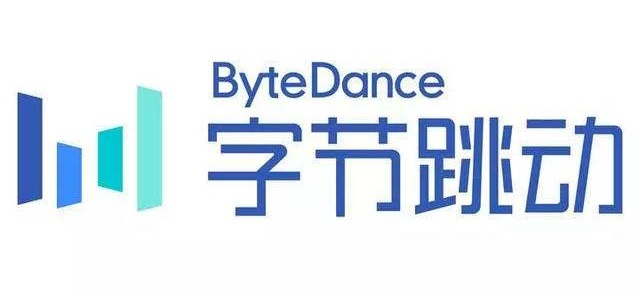
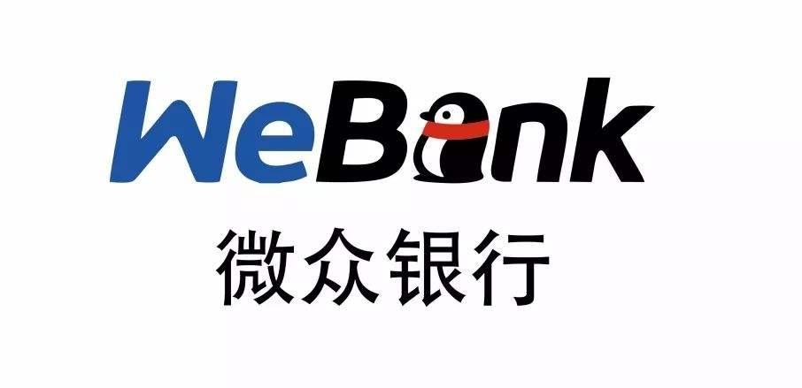
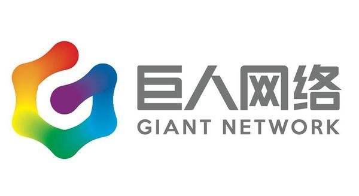

## 2019年最新总结，腾讯，阿里，百度，美团，滴滴，头条等企业岗位需求（Linux, C/C++, Java, golang），内推城市，内推渠道，联系方式，持续更新中。

<table align="center">
  </tr><tr>
  <td align="center">
    <a href="#阿里巴巴">
      
      
阿里巴巴

    </a>
  </td>
  <td align="center">
    <a href="#腾讯">
      
      
腾讯

    </a>
  </td>
  <td align="center">
    <a href="#百度">
      
      
百度

    </a>
  </td>
  <td align="center">
    <a href="#华为">
      
      
华为

    </a>
  </td>
  <td align="center">
    <a href="#美团">
      
      
美团

    </a>
  </td>
  
  </tr><tr>
  
  <td align="center">
    <a href="#京东">
      
      
京东

    </a>
  </td>
  <td align="center">
    <a href="#网易">
      
      
网易

    </a>
  </td>
  <td align="center">
    <a href="#携程">
      
      
携程

    </a>
  </td>
  <td align="center">
    <a href="#新浪">
      
      
新浪

    </a>
  </td>
  <td align="center">
    <a href="#迅雷">
      
      
迅雷

    </a>
  </td>
  
  </tr><tr>
  
  <td align="center">
    <a href="#滴滴出行">
      
      
滴滴出行

    </a>
  </td>
  <td align="center">
    <a href="#字节跳动">
      
      
字节跳动

    </a>
  </td>
  <td align="center">
    <a href="#优酷">
      
      
优酷

    </a>
  </td>
  <td align="center">
    <a href="#蚂蚁金服">
      
      
蚂蚁金服

    </a>
  </td>
  <td align="center">
    <a href="#多益网络">
      
      
多益网络

    </a>
  </td>
  
  </tr><tr>
  
  <td align="center">
    <a href="#微众银行">
      
      
微众银行

    </a>
  </td>
  <td align="center">
    <a href="#饿了么">
      
      
饿了么

    </a>
  </td>
  <td align="center">
    <a href="#高德地图">
      
      
高德地图

    </a>
  </td>
  <td align="center">
    <a href="#哈啰出行">
      
      
哈啰出行

    </a>
  </td>
  <td align="center">
    <a href="#虎牙直播">
      
      
虎牙直播

    </a>
  </td>
  
  </tr><tr>
  
  <td align="center">
    <a href="#沪江网校">
      
      
沪江网校

    </a>
  </td>
  <td align="center">
    <a href="#巨人网络">
      
      
巨人网络

    </a>
  </td>
  <td align="center">
    <a href="#旷视">
      
      
旷视

    </a>
  </td>
  <td align="center">
    <a href="#蘑菇街">
      
      
蘑菇街

    </a>
  </td>
  <td align="center">
    <a href="#陌陌">
      
      
陌陌

    </a>
  </td>
  
  </tr><tr>
  
  <td align="center">
    <a href="#拍拍贷">
      
      
拍拍贷

    </a>
  </td>
  <td align="center">
    <a href="#拼多多">
      
      
拼多多

    </a>
  </td>
  <td align="center">
    <a href="#深信服">
      
      
深信服

    </a>
  </td>
  <td align="center">
    <a href="#顺丰科技">
      
      
顺丰科技

    </a>
  </td>
  <td align="center">
    <a href="#搜狐">
      
      
搜狐

    </a>
  </td>
  
  </tr><tr>
  
</table>

#### 阿里巴巴
##### 数据库DevOps研发工程师/专家（上海，杭州）
岗位描述：
1. 对接云平台，完成OceanBase数据库及平台工具产品的上云和自动化交付；
2. 负责OceanBase商业化工具类产品的开发，以完善OceanBase的周边产品生态，提升客户体验；
3. 开发基于容器的OceanBase数据库及平台工具产品的自动化部署和运维工具;
4. 负责上述产品的相关项目落地及技术支持；
5. 负责或参与DevOps研发团队的建设和管理；
岗位要求：
1. 扎实的编程能力，熟悉 C/C++/Java/Go/Python 中至少一种，有 DevOps工作经验；
2. 熟悉虚拟化技术，熟悉Docker容器技术，有云产品开发经验；
3. 熟悉数据库技术，熟悉MySQL、SQL Server、Oracle、PostgreSQL等关系型数据库中的一种或多种，对分布式系统有深入了解；
4. 了解 Ansible/SaltStack/Puppet/Terraform 等自动化运维工具；
5. 对linux 有深入了解，对计算机网络协议原理有深入了解；
6. 自我驱动，优秀的发现和解决问题能力，良好的沟通能力和团队合作精神。

##### 导航服务C++服务开发专家-车联网（北京）
岗位描述：
1、研究汽车智能化和导航服务前沿技术，从事分布式在线数据引擎和数据服务的设计和研发；
2、负责数据服务的架构搭建和基础设施建设；
3、持续优化数据服务的稳定性/效率/成本/性能，构建灵活易调研的debug系统
岗位要求：
1、全日制统招本科及以上学历，计算机、软件或地理信息（GIS）相关专业；
2、5年以上高并发服务端开发经验，精通Linux/Unix平台上的C/C++编程，具备扎实的编程基本功；
3、精通网络编程、多线程编程，熟悉常见数据结构和常用算法；
4、具备大型分布式系统的开发或运维经验；
5、具备优秀的逻辑思维能力，对解决挑战性问题充满热情，善于解决问题和分析问题；
6、拥有优秀的学习能力和强烈的求知欲，能适应工作压力，具备团队协作精神；
7、有导航、规划、算路等后台服务经验和背景佳；

##### 导航服务C++服务开发专家-车联网（北京）
岗位描述：
1、研究汽车智能化和导航服务前沿技术，从事分布式在线数据引擎和数据服务的设计和研发；
2、负责数据服务的架构搭建和基础设施建设；
3、持续优化数据服务的稳定性/效率/成本/性能，构建灵活易调研的debug系统
岗位要求：
1、全日制统招本科及以上学历，计算机、软件或地理信息（GIS）相关专业；
2、5年以上高并发服务端开发经验，精通Linux/Unix平台上的C/C++编程，具备扎实的编程基本功；
3、精通网络编程、多线程编程，熟悉常见数据结构和常用算法；
4、具备大型分布式系统的开发或运维经验；
5、具备优秀的逻辑思维能力，对解决挑战性问题充满热情，善于解决问题和分析问题；
6、拥有优秀的学习能力和强烈的求知欲，能适应工作压力，具备团队协作精神；
7、有导航、规划、算路等后台服务经验和背景佳；

#### 腾讯

##### 企业发展事业群 - 后台开发高级工程师（北京）
工作职责
1. 负责开发证券行情后台系统； 
2. 参与相关产品需求讨论、架构设计、财经后台现有系统的架构优化，升级； 
3. 跟进后台服务研发运维工作。
工作要求
1. 熟悉掌握C/C++/Python/PHP/GO一种或多种开发语言，熟悉shell命令； 
2. 包括2年以上Unix/linux下Server开发经验，熟悉Unix/Linux下常用架构设计方法； 
3. 熟练使用 Mysql、Redis等数据库，具有MySQL索引优化、查询优化和存储优化方面的经验； 
4. 熟练使用Linux操作系统，了解常用的算法，数据结构，掌握面向对象编程； 
5. 代码风格良好，熟悉常见的设计模式，具备中型系统的规划设计能力，具备运维问题的分析定位能力 
6. 工作积极主动，有责任心，严谨细致，有激情，有一定的测试意识，有一定的项目管理意识；

##### 企业发展事业群 - 理财通后台开发工程师（深圳）
工作职责
1. 负责开发证券行情后台系统； 
2. 参与相关产品需求讨论、架构设计、财经后台现有系统的架构优化，升级； 
3. 跟进后台服务研发运维工作。
工作要求
1. 熟悉掌握C/C++/Python/PHP/GO一种或多种开发语言，熟悉shell命令； 
2. 包括2年以上Unix/linux下Server开发经验，熟悉Unix/Linux下常用架构设计方法； 
3. 熟练使用 Mysql、Redis等数据库，具有MySQL索引优化、查询优化和存储优化方面的经验； 
4. 熟练使用Linux操作系统，了解常用的算法，数据结构，掌握面向对象编程； 
5. 代码风格良好，熟悉常见的设计模式，具备中型系统的规划设计能力，具备运维问题的分析定位能力 
6. 工作积极主动，有责任心，严谨细致，有激情，有一定的测试意识，有一定的项目管理意识；

##### 企业发展事业群 - 证券业务C++后台开发高级工程师（深圳）
工作职责
1. 负责证券交易、风控、清算、资讯、行情等系统的开发维护，建设证券业务相关的技术基础平台。
工作要求
1. 良好的综合素质：严谨细致、尽责进取、有激情、爱学习、善沟通、能承压； 
2. 熟悉Linux下的常用命令和脚本编程，熟悉常见Linux服务器的架设与使用； 
3. 熟悉Linux下C++后台服务编程，有扎实基础和项目经验者优先； 
4. 熟悉Linux下网络与多线程编程，熟悉事务型数据库（MySQL优先）开发，熟悉PKI等信息安全基础知识； 
5. 代码风格良好，熟悉常见的设计模式，具备中型系统的规划设计能力，具备运维问题的分析定位能力，有一定的API设计意识，有一定的测试意识，有一定的项目管理意识； 
6. 有证券或其他金融系统开发经验或海量互联网系统的设计/开发经验者优先。

##### 微信事业群 - 微信开放平台后台策略安全工程师（广州）
工作职责
1. 负责分析、挖掘、对抗各种业务安全层面的恶意行为,负责各类业务安全策略的制订。
工作要求
1. 有Unix/Linux操作系统下的C/C++项目的2年以上开发经验； 
2. 熟练掌握shell编程,熟悉mysql等关系型数据库； 
3. 热爱数据，对数据敏感，热爱数据分析，热爱挖掘各类数据中隐藏的实际价值； 
4. 品行端正，性格开朗，思维活跃，推理能力、逻辑思维强； 
5. 有实际业务安全经验者，有机器学习、深度学习、海量数据分析经验者优先。

##### 微信事业群 - 微信公众平台后台开发工程师（广州）
工作职责
1. 负责公众平台后台整体架构设计和业务开发，包括公众号消息通道、关系链、视频、文章、第三方服务等整个公众号生态的搭建。
工作要求
1. 本科及以上学历，计算机相关专业； 
2. 熟悉 C/C++的linux后台开发、包括多进程、多线程开发模式、TCP/IP协议栈，socket编程等； 
3. 熟悉业界常见的开源网络框架、开源存储系统（包括内存/外存系统，关系型数据库及NoSQL系统）； 
4. 突出的学习能力/钻研精神/反应力/沟通表达能力。 
5. 如果您还具备以下技能，我们会优先考虑： 
6. 有过良好的高并发系统的后台开发经验； 
7. 具备机器学习框架的开发使用经验； 
8. 具备一定的数据处理/分析能力。

##### 平台与内容事业群 - 应用宝商业化后台开发（深圳）
工作职责
1. 负责应用宝商业化创新业务后台开工作
工作要求
1. 有Unix/Linux操作系统下的C/C++项目的3年以上开发经验；
2. 熟悉网络编程；熟悉Linux下的mysql开发；
3. 精通TCP/IP协议及编程，熟悉互联网应用协议；
4. 熟悉面向对象的大型分布式系统设计与开发，了解中间件的技术以及基于中间件的开发模式；
5. 全面的软件知识结构（操作系统、软件工程、设计模式、数据结构、数据库系统、网络安全）；
6. 具备良好的分析解决问题能力，能独立承担任务和有系统进度把控能力；
7. 责任心强，良好的对外沟通和团队协作能力，主动，好学；

#### 百度
##### 企业智能平台部 - Java研发工程师
工作职责：
1. 参与团队内部相关产品的设计、研发和优化工作
2. 负责企业级产品与AI结合方向的研发
3. 持续改进和优化，支持内部软件及平台快速发展的业务
4. 与研发团队成员进行技术交流，互相促进技术能力的提升

职位要求：
1. 1年以上互联网公司\大型企业软件的研发经验，擅长web系统研发
2. 对Java面向对象软件架构有深入理解以及很强的动手能力。熟练应用J2EE等WEB开发技术，熟练掌握Spring等主流的开发框架
3. 能熟练使用Maven及GIT工具
4. 熟悉前后端数据交互，对前端开发有一定基础，熟悉WebService，CXF，AXIS等服务框架
5. 熟练使用MySQL等主流数据库。熟练使用linux, 熟悉shell、python等至少一种脚本语言
6. 对技术有热情，思路开阔，善于思考，关注业界新知，喜欢和他人交流和分享，能够对自己负责研发的产品提出改进建议
7. 有分布式、大型系统性能调优、敏捷开发相关经验者优先
8. 同时具备php、C#等其它一门或多门语言者优先

##### 地图数据引擎部 - 大数据云计算研发工程师（北京）
工作职责:
1. 负责数据平台相关研发工作
2. 将设计方案实现为具体的平台功能，持续跟踪结果、不断优化体验
3. 参与平台数据结构和系统架构设计

职责要求:
1. 计算机相关专业，统招全日制本科及以上学历，2年以上工作经验
2. 对Spark及Hadoop技术有深入了解
3. 熟悉Python/Java/Scala/Php等编程语言，熟练使用SQL，有良好的编码习惯，对分布式有深刻理解
4. 了解Windows、Unix、Linux等主流操作系统原理，熟练运用系统层支持应用开发
5. 技术视野开阔，有强烈的上进心和求知欲，善于学习和运用新知识，勇于解决难题
6. 善于沟通和逻辑表达，拥有优秀的分析问题和解决问题的能力，良好的团队合作精神和积极主动的沟通意识
7. 有激情，具有自我驱动力，追求卓越
8. 计算机领域相关的编程大赛获奖、专业期刊发表文章或者有发明专利等
9. 具备大数据云平台、计算存储平台、可视化开发平台经验，熟悉软件工程开发流程
10. 具备专业领域的计算机知识和技能： Storm/Hive/Hbase/Storm/Kafka等

##### 地图数据引擎部 - 大数据云计算研发工程师（北京）
工作职责:
1. 负责数据平台相关研发工作
2. 将设计方案实现为具体的平台功能，持续跟踪结果、不断优化体验
3. 参与平台数据结构和系统架构设计
职责要求:
1. 计算机相关专业，统招全日制本科及以上学历，2年以上工作经验
2. 对Spark及Hadoop技术有深入了解
3. 熟悉Python/Java/Scala/Php等编程语言，熟练使用SQL，有良好的编码习惯，对分布式有深刻理解
4. 了解Windows、Unix、Linux等主流操作系统原理，熟练运用系统层支持应用开发
5. 技术视野开阔，有强烈的上进心和求知欲，善于学习和运用新知识，勇于解决难题
6. 善于沟通和逻辑表达，拥有优秀的分析问题和解决问题的能力，良好的团队合作精神和积极主动的沟通意识
7. 有激情，具有自我驱动力，追求卓越
8. 计算机领域相关的编程大赛获奖、专业期刊发表文章或者有发明专利等
9. 具备大数据云平台、计算存储平台、可视化开发平台经验，熟悉软件工程开发流程
10. 具备专业领域的计算机知识和技能： Storm/Hive/Hbase/Storm/Kafka等

##### 地图出行业务部 - 地图数据挖掘工程师（北京）

工作职责:
1. 通过海量的用户轨迹、服务日志优化路径规划算法，提高路线的合理性
2. 通过海量的用户轨迹挖掘用户驾驶行为习惯，提高用户导航满意率
3. 负责百度导航地图路径规划引擎的算法研发和策略优化
4. 热爱互联网，对互联网产品和技术有浓厚的兴趣，热衷于追求技术极致与创新

职责要求:
1. 扎实的编程语言（C++／python或者其他）／数据结构／常用基础算法的基础，过硬的代码能力
2. 优秀的分析问题和解决问题的能力，勇于解决难题
3. 强烈的上进心和求知欲，较强的学习能力和沟通能力，具备良好的团队合作精神
具有以下条件者优先考虑：
- 有一定相关项目经验优先
- 在机器学习或数据挖掘方向有较强的积累，熟悉经典的算法并有实践经验，包括LR、GBDT、XGBoost、Reinforcement Learning、Deep Learning等优先

##### 系统部 - 资深系统工程师（北京）
工作职责:
1. 负责百度核心基础服务（如DNS、负载均衡、NTP、攻击防护流量清洗、mailrelay等）的架构设计、平台建设和运维
2. 负责百度核心基础服务的产品开发，持续优化迭代产品功能和性能
3. 负责大规模服务集群自动化管理平台开发，持续提升运维效率

职责要求:
1. 计算机、通信及相关专业
2. 熟悉Linux平台开发，并具有Linux系统运维经验
3. 熟练掌握C/C++/Python/Shell/Java/Go等语言，熟悉BIND、LVS、POSTFIX等相关基础服务软件代码或自动化运维工具开发者优先
4. 具备一定的网络知识，熟悉TCP/IP通信原理，熟悉socket编程或网络设备配置者优先
5. 认真负责，优秀的学习能力，出色的沟通能力，较强的分析和解决复杂网络问题能力

##### 系统部 - 后台研发工程师（北京）
工作职责:
1. 负责CDN流量调度后台研发，在数百个节点间实时调度数十Tb/s的流量
2. 分析并优化流量波形控制，计费优化，节点选优等算法与策略，提升业务质量，降低成本
3. 实践先进的软件工程理念，产出开高质量代码和文档，保证软件极高的可维护性和稳定性
4. 快速学习相关领域的新产品与新技术，推动技术革新

职责要求:
1. 本科或以上学历，有较丰富的后台开发经验
2. 责任心强，能力强，对负责的事情有深入的把握
3. 精通python或者Go语言，具备较好的算法和策略的基础

#### 华为
#### 美团
#### 京东
#### 网易
#### 携程
#### 新浪
#### 迅雷
#### 滴滴出行
#### 字节跳动
#### 优酷
#### 蚂蚁金服
#### 多益网络
#### 微众银行
#### 饿了么
#### 高德地图
#### 哈啰出行
#### 虎牙直播
#### 沪江网校
#### 巨人网络
#### 旷视
#### 蘑菇街
#### 陌陌
#### 拍拍贷
#### 拼多多
#### 深信服
#### 顺丰科技
#### 搜狐

