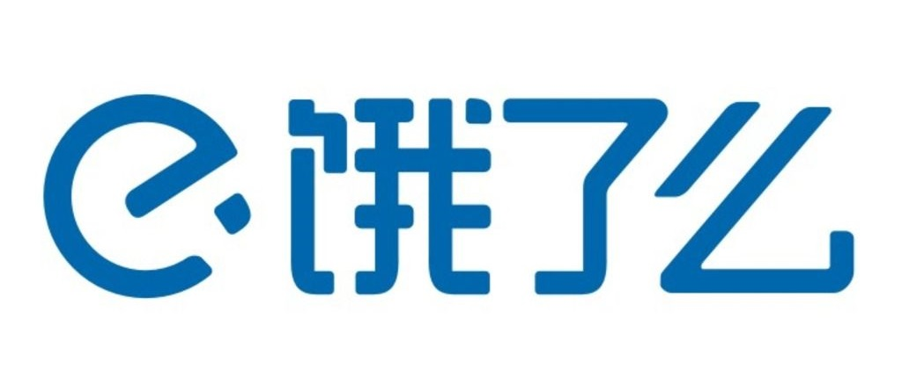

## 2019年最新总结，腾讯，阿里，百度，美团，滴滴，头条等企业岗位需求（Linux, C/C++, Java, golang），内推城市，内推渠道，联系方式，持续更新中。

 
 

<table align="center">
  </tr><tr>
  <td align="center">
    <a href="#阿里巴巴">
      
      
阿里巴巴

    </a>
  </td>
  <td align="center">
    <a href="#腾讯">
      
      
腾讯

    </a>
  </td>
  <td align="center">
    <a href="#百度">
      
      
百度

    </a>
  </td>
  <td align="center">
    <a href="#华为">
      
      
华为

    </a>
  </td>
  <td align="center">
    <a href="#美团">
      
      
美团

    </a>
  </td>
  
  </tr><tr>
  
  <td align="center">
    <a href="#京东">
      
      
京东

    </a>
  </td>
  <td align="center">
    <a href="#网易">
      
      
网易

    </a>
  </td>
  <td align="center">
    <a href="#携程">
      
      
携程

    </a>
  </td>
  <td align="center">
    <a href="#新浪">
      
      
新浪

    </a>
  </td>
  <td align="center">
    <a href="#迅雷">
      
      
迅雷

    </a>
  </td>
  
  </tr><tr>
  
  <td align="center">
    <a href="#滴滴出行">
      
      
滴滴出行

    </a>
  </td>
  <td align="center">
    <a href="#字节跳动">
      
      
字节跳动

    </a>
  </td>
  <td align="center">
    <a href="#优酷">
      
      
优酷

    </a>
  </td>
  <td align="center">
    <a href="#蚂蚁金服">
      
      
蚂蚁金服

    </a>
  </td>
  <td align="center">
    <a href="#多益网络">
      
      
多益网络

    </a>
  </td>
  
  </tr><tr>
  
  <td align="center">
    <a href="#微众银行">
      
      
微众银行

    </a>
  </td>
  <td align="center">
    <a href="#饿了么">
      
      
饿了么

    </a>
  </td>
  <td align="center">
    <a href="#高德地图">
      
      
高德地图

    </a>
  </td>
  <td align="center">
    <a href="#哈啰出行">
      
      
哈啰出行

    </a>
  </td>
  <td align="center">
    <a href="#虎牙直播">
      
      
虎牙直播

    </a>
  </td>
  
  </tr><tr>
  
  <td align="center">
    <a href="#沪江网校">
      
      
沪江网校

    </a>
  </td>
  <td align="center">
    <a href="#巨人网络">
      
      
巨人网络

    </a>
  </td>
  <td align="center">
    <a href="#旷视">
      
      
旷视

    </a>
  </td>
  <td align="center">
    <a href="#蘑菇街">
      
      
蘑菇街

    </a>
  </td>
  <td align="center">
    <a href="#陌陌">
      
      
陌陌

    </a>
  </td>
  
  </tr><tr>
  
  <td align="center">
    <a href="#拍拍贷">
      
      
拍拍贷

    </a>
  </td>
  <td align="center">
    <a href="#拼多多">
      
      
拼多多

    </a>
  </td>
  <td align="center">
    <a href="#深信服">
      
      
深信服

    </a>
  </td>
  <td align="center">
    <a href="#顺丰科技">
      
      
顺丰科技

    </a>
  </td>
  <td align="center">
    <a href="#搜狐">
      
      
搜狐

    </a>
  </td>
  
  </tr><tr>
  
</table>

 
 
</tr><tr>
  
#### 阿里巴巴

##### [数据库DevOps研发工程师/专家（上海，杭州）](阿里巴巴.md#数据库devops研发工程师专家上海杭州)

##### [导航服务C++服务开发专家-车联网（北京）](阿里巴巴.md#导航服务c服务开发专家-车联网北京)

  
#### 腾讯

##### [企业发展事业群 - 后台开发高级工程师（北京）](腾讯.md#企业发展事业群---后台开发高级工程师北京)

##### [企业发展事业群 - 理财通后台开发工程师（深圳）](腾讯.md#企业发展事业群---理财通后台开发工程师深圳)

##### [企业发展事业群 - 证券业务C++后台开发高级工程师（深圳）](腾讯.md#企业发展事业群---证券业务c后台开发高级工程师深圳)

##### [微信事业群 - 微信开放平台后台策略安全工程师（广州）](腾讯.md#微信事业群---微信开放平台后台策略安全工程师广州)

##### [微信事业群 - 微信公众平台后台开发工程师（广州）](腾讯.md#微信事业群---微信公众平台后台开发工程师广州)

##### [平台与内容事业群 - 应用宝商业化后台开发（深圳）](腾讯.md#平台与内容事业群---应用宝商业化后台开发深圳)

#### 百度

##### [企业智能平台部 - Java研发工程师（北京）](百度.md#企业智能平台部---java研发工程师)

##### [地图数据引擎部 - 大数据云计算研发工程师（北京）](百度.md#地图数据引擎部---大数据云计算研发工程师北京)

##### [地图出行业务部 - 地图数据挖掘工程师（北京）](百度.md#地图出行业务部---地图数据挖掘工程师北京)

##### [系统部 - 资深系统工程师（北京）](百度.md#系统部---资深系统工程师北京)

##### [系统部 - 后台研发工程师（北京）](百度.md#系统部---后台研发工程师北京)

#### 华为

#### 美团

##### [后端高级研发工程师（厦门）](美团.md#后端高级研发工程师厦门)

##### [Web后端开发工程师（北京）](美团.md#web后端开发工程师北京)

##### [后端技术负责人（北京）](美团.md#后端技术负责人北京)

##### [系统开发工程师（北京）](美团.md#系统开发工程师北京)

##### [风控数据平台研发工程师（北京）](美团.md#风控数据平台研发工程师北京)

##### [技术专家-基础架构（北京）](美团.md#技术专家-基础架构北京)

#### 京东

##### [软件开发工程师 （北京）](京东.md#软件开发工程师北京)

##### [C++高级工程师（北京）](京东.md#c高级工程师北京)

##### [后端研发工程师（北京）](京东.md#后端研发工程师北京)

##### [广告算法工程师（北京）](京东.md#广告算法工程师北京)

##### [软件开发工程师 （北京）](京东.md#软件开发工程师北京-1)

#### 网易
#### 携程
#### 新浪
#### 迅雷
#### 滴滴出行
#### 字节跳动
#### 优酷
#### 蚂蚁金服
#### 多益网络
#### 微众银行
#### 饿了么
#### 高德地图
#### 哈啰出行
#### 虎牙直播
#### 沪江网校
#### 巨人网络
#### 旷视
#### 蘑菇街
#### 陌陌
#### 拍拍贷
#### 拼多多
#### 深信服
#### 顺丰科技
#### 搜狐

