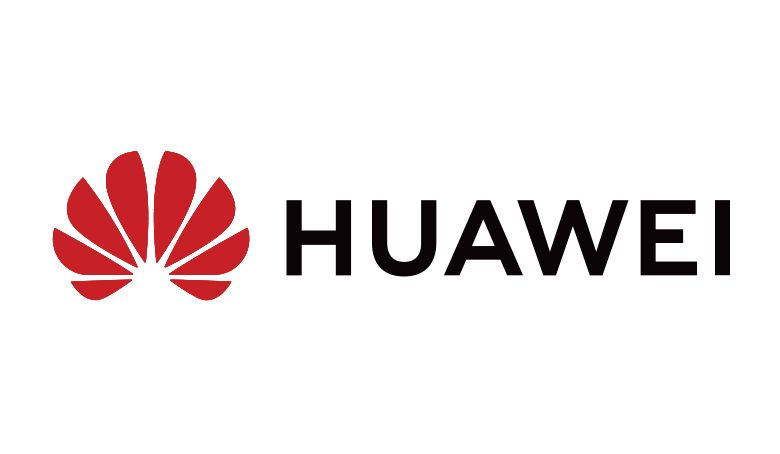

## 2019年最新总结，腾讯，阿里，百度，美团，滴滴，头条等企业岗位需求（Linux, C/C++, Java, golang），内推城市，内推渠道，联系方式，持续更新中。

<table align="center">
  </tr><tr>
  <td align="center">
    <a href="infos/阿里巴巴.md">
      
      
阿里巴巴

    </a>
  </td>
  <td align="center">
    <a href="infos/腾讯.md">
      
      
腾讯

    </a>
  </td>
  <td align="center">
    <a href="infos/百度.md">
      
      
百度

    </a>
  </td>
  <td align="center">
    <a href="infos/华为.md">
      
      
华为

    </a>
  </td>
  <td align="center">
    <a href="infos/美团.md">
      
      
美团

    </a>
  </td>
  
  </tr><tr>
  
  <td align="center">
    <a href="infos/京东.md">
      
      
京东

    </a>
  </td>
  <td align="center">
    <a href="infos/网易.md">
      
      
网易

    </a>
  </td>
  <td align="center">
    <a href="infos/携程.md">
      
      
携程

    </a>
  </td>
  <td align="center">
    <a href="infos/新浪.md">
      
      
新浪

    </a>
  </td>
  <td align="center">
    <a href="infos/迅雷.md">
      
      
迅雷

    </a>
  </td>
  
  </tr><tr>
  
  <td align="center">
    <a href="infos/滴滴出行.md">
      
      
滴滴出行

    </a>
  </td>
  <td align="center">
    <a href="infos/字节跳动.md">
      
      
字节跳动

    </a>
  </td>
  <td align="center">
    <a href="infos/优酷.md">
      
      
优酷

    </a>
  </td>
  <td align="center">
    <a href="infos/蚂蚁金服.md">
      
      
蚂蚁金服

    </a>
  </td>
  <td align="center">
    <a href="infos/多益网络.md">
      
      
多益网络

    </a>
  </td>
  
  </tr><tr>
  
  <td align="center">
    <a href="infos/微众银行.md">
      
      
微众银行

    </a>
  </td>
  <td align="center">
    <a href="infos/饿了么.md">
      
      
饿了么

    </a>
  </td>
  <td align="center">
    <a href="infos/高德地图.md">
      
      
高德地图

    </a>
  </td>
  <td align="center">
    <a href="infos/哈啰出行.md">
      
      
哈啰出行

    </a>
  </td>
  <td align="center">
    <a href="infos/虎牙直播.md">
      
      
虎牙直播

    </a>
  </td>
  
  </tr><tr>
  
  <td align="center">
    <a href="infos/沪江网校.md">
      
      
沪江网校

    </a>
  </td>
  <td align="center">
    <a href="infos/巨人网络.md">
      
      
巨人网络

    </a>
  </td>
  <td align="center">
    <a href="infos/旷视.md">
      
      
旷视

    </a>
  </td>
  <td align="center">
    <a href="infos/蘑菇街.md">
      
      
蘑菇街

    </a>
  </td>
  <td align="center">
    <a href="infos/陌陌.md">
      
      
陌陌

    </a>
  </td>
  
  </tr><tr>
  
  <td align="center">
    <a href="infos/拍拍贷.md">
      
      
拍拍贷

    </a>
  </td>
  <td align="center">
    <a href="infos/拼多多.md">
      
      
拼多多

    </a>
  </td>
  <td align="center">
    <a href="infos/深信服.md">
      
      
深信服

    </a>
  </td>
  <td align="center">
    <a href="infos/顺丰科技.md">
      
      
顺丰科技

    </a>
  </td>
  <td align="center">
    <a href="infos/搜狐.md">
      
      
搜狐

    </a>
  </td>
  
  </tr><tr>
  
</table>

#### 阿里巴巴
#### 腾讯
#### 百度
#### 华为
#### 美团
#### 京东
#### 网易
#### 携程
#### 新浪
#### 迅雷
#### 滴滴出行
#### 字节跳动
#### 优酷
#### 蚂蚁金服
#### 多益网络
#### 微众银行
#### 饿了么
#### 高德地图
#### 哈啰出行
#### 虎牙直播
#### 沪江网校
#### 巨人网络
#### 旷视
#### 蘑菇街
#### 陌陌
#### 拍拍贷
#### 拼多多
#### 深信服
#### 顺丰科技
#### 搜狐

